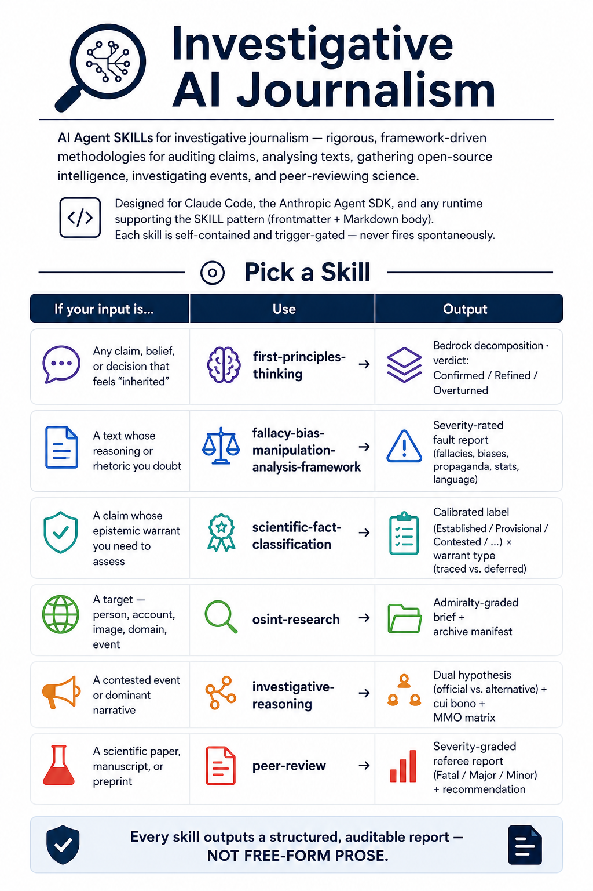

# Investigative AI Journalism

<p align="center">
  
</p>

AI Agent **SKILLs** for investigative journalism — rigorous, framework-driven methodologies for auditing claims, analysing texts, gathering open-source intelligence, investigating events, and peer-reviewing science.

Designed for [Claude Code](https://claude.com/claude-code), the Anthropic Agent SDK, and any runtime supporting the SKILL pattern (frontmatter + Markdown body). Each skill is self-contained and **trigger-gated** — never fires spontaneously.

---

## Pick a Skill

| If your input is… | Use | Output |
|---|---|---|
| Any claim, belief, or decision that feels "inherited" | [`first-principles-thinking`](./.claude/skills/first-principles-thinking) | Bedrock decomposition · verdict: Confirmed / Refined / Overturned |
| A text whose reasoning or rhetoric you doubt | [`fallacy-bias-manipulation-analysis-framework`](./.claude/skills/fallacy-bias-manipulation-analysis-framework) | Severity-rated fault report (fallacies, biases, propaganda, stats, language) |
| A claim whose epistemic warrant you need to assess | [`scientific-fact-classification`](./.claude/skills/scientific-fact-classification) | Calibrated label (Established / Provisional / Contested / …) × warrant type (traced vs. deferred) |
| A target — person, account, image, domain, event | [`osint-research`](./.claude/skills/osint-research) | Admiralty-graded brief + archive manifest |
| A contested event or dominant narrative | [`investigative-reasoning`](./.claude/skills/investigative-reasoning) | Dual hypothesis (official vs. alternative) + cui bono + MMO matrix |
| A scientific paper, manuscript, or preprint | [`peer-review`](./.claude/skills/peer-review) | Severity-graded referee report (Fatal / Major / Minor) + recommendation |

Every skill outputs a **structured, auditable report** — not free-form prose.

---

## How They Fit Together

```
                  ┌────────────────────────────────────┐
                  │     first-principles-thinking      │  ← orthogonal sanity check
                  └────────────────────────────────────┘

   osint-research  ─────────►  investigative-reasoning
       (gather)                  (theorise about events)
                                          ▲
   fallacy-bias  +  scientific-fact-classification
       (text)            (claim warrant)
                                          ▲
                                   peer-review
                            (integrative — on scientific papers)
```

Hand-offs declared inside the skills:
- `osint-research` → `investigative-reasoning` once gathering is done and hypothesis work begins.
- `peer-review` delegates claim-typing to `scientific-fact-classification`, rhetoric to `fallacy-bias-…`, motive/deception to `investigative-reasoning`.
- `first-principles-thinking` is orthogonal — invokable inside any other skill whenever a load-bearing claim feels inherited rather than derived.

---

## What is a SKILL?

```yaml
---
name: skill-name
description: When and why to invoke this skill
---

# Phases, checklists, output format
```

`description` tells the agent *when* to load the skill; the body tells it *how* to execute.

---

## The Skills

### [`first-principles-thinking`](./.claude/skills/first-principles-thinking)
> Decompose a claim or proposal to bedrock truths and rebuild reasoning from there.

Four moves: state · decompose · excavate to Bedrock / Assumption / Unknown · rebuild. Compact engine for stress-testing conventional wisdom or stuck arguments.

**Triggers:** *"break this down from first principles"*, *"is this actually true?"*, *"why is it done this way?"*, *"what are we assuming?"*, *"rethink this"*, *"challenge my thinking"*.

---

### [`fallacy-bias-manipulation-analysis-framework`](./.claude/skills/fallacy-bias-manipulation-analysis-framework)
> Audit a text for logical fallacies, cognitive biases, rhetorical manipulation, and statistical deception.

Steelman first, then systematic scan: formal → informal fallacies → cognitive biases → rhetoric/propaganda (firehose, motte-and-bailey, DARVO, gaslighting, …) → statistical manipulation → linguistic and discourse-level. Severity-tagged with steelman repair for every load-bearing flaw.

**Triggers:** *"analyse this for fallacies"*, *"find the cognitive biases"*, *"audit this reasoning"*, *"is this propaganda?"*, *"what rhetorical tricks"*, *"stress-test this argument"*, *"find the manipulation"*.

---

### [`scientific-fact-classification`](./.claude/skills/scientific-fact-classification)
> Classify each claim along a spectrum from established fact to unfalsifiable belief.

Replaces the binary fact / not-fact verdict. Per claim: type → falsifiability → evidence tier + GRADE → Bradford Hill (causal claims) → Bayesian weighing → confidence label × warrant type (**traced** vs. **deferred to consensus** — explicitly flags consensus failure modes: funder capture, prestige cascades, replication-crisis fields).

**Triggers:** *"is X a fact?"*, *"weigh the evidence for Y"*, *"classify these claims"*, *"distinguish fact from assumption"*, *"has this been proven?"*, *"how well-supported is this?"*, *"is this objective?"*.

---

### [`osint-research`](./.claude/skills/osint-research)
> Plan, execute, and verify open-source intelligence using only publicly available information (PAI).

Five-phase cycle (Planning → Collection → Processing → Analysis → Dissemination), calibrated to what an AI agent can actually do without shell access or paid databases. **Admiralty Code** (NATO STANAG 2511) grading on independent reliability/credibility axes. Pivoting chains for name / username / email / domain / phone / image / entity. Hard constraints — PAI only, no active engagement, no facial recognition on private individuals, harm minimisation — define the boundary between OSINT and conduct that is unethical, unlawful, or operationally compromising.

**Triggers:** *"find out about X"*, *"build a profile on X"*, *"who is behind this account?"*, *"verify this image/video"*, *"where/when was this taken?"*, *"trace this username/email/domain"*, *"digital footprint of X"*.

**Pairs with:** `investigative-reasoning` (gathering → hypothesis construction).

---

### [`investigative-reasoning`](./.claude/skills/investigative-reasoning)
> Critically analyse events, detect deception, develop ranked alternative hypotheses.

Detective-method playbook. **Mandates web search at every phase** to break free of training-data bias toward official narratives. Source tiers (Tier 0 = contemporary primary), CoI demotion, geopolitical-alignment checks, evidence ladder. **18 influence-operation patterns** (false flag, problem–reaction–solution, limited hangout, controlled opposition, astroturfing, …). **Dual-hypothesis mandate:** every investigation produces a steelmanned official narrative AND a steelmanned alternative, compared head-to-head.

**Triggers:** *"investigate this event"*, *"develop a conspiracy theory about X"*, *"who benefits from Y?"*, *"apply critical thinking to this narrative"*, *"find red flags in this explanation"*.

---

### [`peer-review`](./.claude/skills/peer-review)
> Rigorous, citation-verified peer review of scientific papers.

Audits methodology, statistics, causal claims, citations, reproducibility, and literature context. Calibrates standards to the paper's genre and field (preprint vs. journal; RCT vs. observational; ML vs. lab biology). Audits the **inferential gap** between what was measured and what is claimed. **Verifies load-bearing citations** by fetching the cited source and comparing it to the paper's claim (Supports / Partial / Contradicts / Unrelated / Unverifiable). Outputs severity tags (**Fatal / Major / Minor / Optional / Praise**), an explicit recommendation, and *what would change it upward or downward*. Enforces symmetry under conclusion-flip.

**Triggers:** *"review this paper"*, *"is this study sound?"*, *"audit the methodology"*, *"do the results support the conclusion?"*, *"verify the citations"*, *"is this reproducible?"*, *"produce a referee report"*.

**Pairs with:** `scientific-fact-classification` (claim typing, evidence grading), `fallacy-bias-…` (rhetoric on position papers), `investigative-reasoning` (motive/deception analysis). `peer-review` orchestrates these and adds methodology, statistical, citation-verification, reproducibility, and literature-context layers itself.

---

## Installation

The skills live under `.claude/skills/` in this repository — Claude Code's standard skills location — so an AI agent can copy them in place without any path rewriting.

Paste this to Claude Code (or any AI coding agent with shell access):

> Install the SKILLs from `https://github.com/patricksavalle/investigate-journalism-skills`.
> Clone the repository to a temporary location, then copy every folder inside its `.claude/skills/`
> directory into my `~/.claude/skills/` directory (for user-level, available across all projects).
> If I'd prefer a project-scoped install, copy them into this project's `.claude/skills/` instead —
> ask me which one I want. After copying, remind me to restart Claude Code or run `/skills` so
> the new skills are loaded.

**Other AI runtimes:** any runtime supporting the SKILL pattern can use these files directly. Point your skill loader at `.claude/skills/`.

---

## Design Principles

- **Trigger-gated** — never spontaneous; always explicit invocation.
- **Charity first** — steelman the target before challenging it.
- **Self-audit** — same standards regardless of which side the conclusion lands on.
- **Calibration over verdict** — graded confidence labels, not binary judgements.
- **Traceability** — distinguish what has been followed to primary evidence from what is taken on authority.
- **Honest tooling boundaries** — frameworks state what an AI agent can and cannot do natively; no fabricated tradecraft.
- **Structured output** — every framework specifies its report format so findings are auditable.

---

## Contributing

Issues and PRs welcome. New SKILLs should follow the existing structure:

1. Frontmatter with `name` and `description`
2. Explicit **Activation** section listing trigger phrases (and explicit non-triggers where useful)
3. Phase-numbered methodology (Phase 0 = pre-analysis discipline)
4. Defined **Output Format** block
5. **Quick-Reference Matrix** at end
6. Where relevant, an explicit **Pairs with** rule

---

## License

See [LICENSE](./LICENSE).
